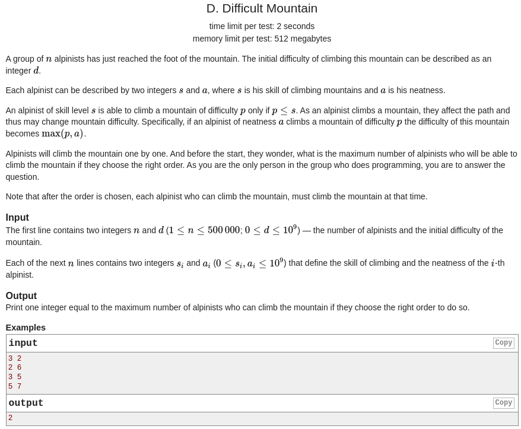
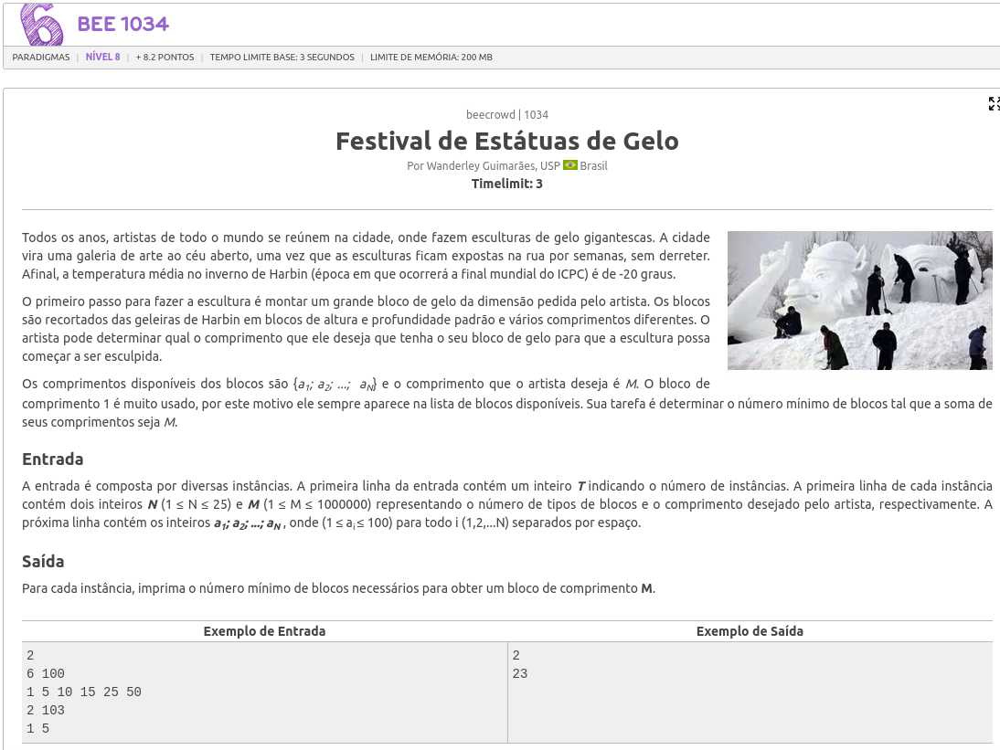
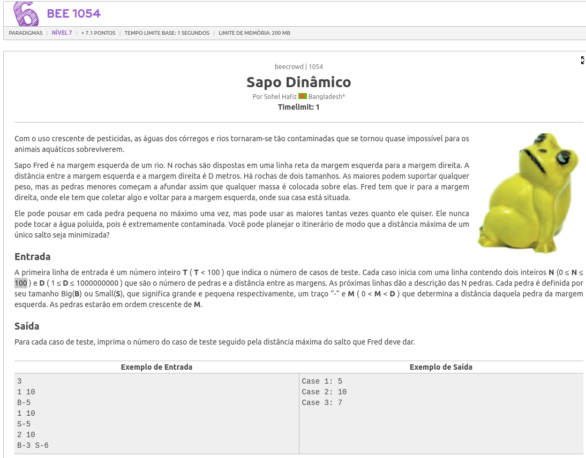

# Algoritmos_Ambiciosos_listas_de_exercicios

**Número da Lista**: 23<br>
**Conteúdo da Disciplina**: Algoritmos Ambiciosos<br>

## Alunos
|Matrícula | Aluno |
| -- | -- |
| 19/0055006  |  Gian Medeiros Rosa |
| 20/0073249  |  Pedro Vitor Augusto de Jesus |

## Sobre 
O objetivo deste trabalho é abordar problemas de competições de programação, utilizando conceitos e algoritmos estudados na unidade de algoritmos ambiciosos.

<p>A lógica e as soluções dos exercícios podem ser diferentes das analisadas na unidade, devido a especificações e características específicas de cada problema e solução.


Links de apresentação: 

- [Difficult Mountain](https://codeforces.com/problemset/problem/1601/D) - [solução]()
- [Festival de Estátuas de Gelo](https://judge.beecrowd.com/pt/problems/view/1034) - [solução]()
- [Sapo Dinâmico](https://judge.beecrowd.com/pt/problems/view/1054) - [solução]()

<!-- <iframe width="560" height="315" src="files/videos/apresentacao.mp4" frameborder="0" allow="accelerometer; autoplay; clipboard-write; encrypted-media; gyroscope; picture-in-picture" allowfullscreen></iframe> -->

## Screenshots

### Questão 1: [Difficult Mountain](https://codeforces.com/problemset/problem/1601/D)
- Dificuldade hanking D - 2700 do codeforces.



### Questão 2: [Festival de Estátuas de Gelo](https://judge.beecrowd.com/pt/problems/view/1034)
- Dificuldade nível 8 URI.



### Questão 3: [Sapo Dinâmico](https://judge.beecrowd.com/pt/problems/view/1054)
- Dificuldade nível 7 URI.



## Instalação 
**Linguagem**: C++<br>
**Compilador**: g++<br>

## Uso 

### Assegure ter o compilador g++ para C++ instalado em sua máquina:

### entre na pasta do problema que deseja executar
```bash
cd src/difficult_montain/
```

### Compile o arquivo main.cpp:
```bash
g++ -o prog -W -Wall main.cpp
```

### execute a solução:
```bash
./prog
```

### Adicione a entrada do exercício em questão:
```bash
# exemplo:
3 2
2 6
3 5
5 7
```

## Outros


